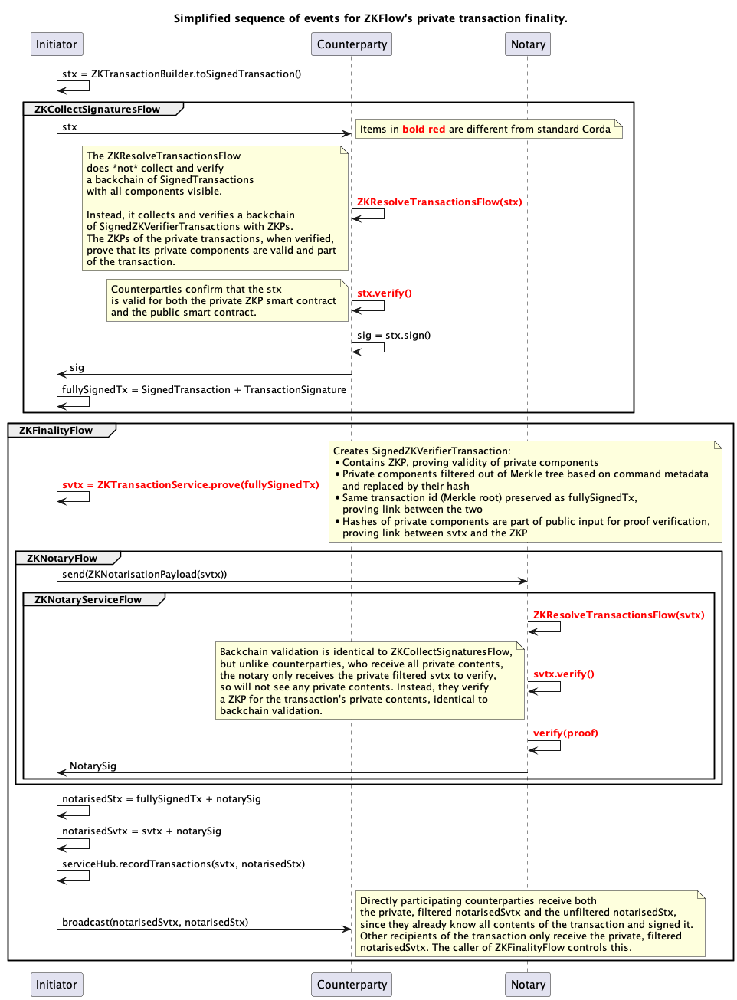

The ZKFlow Protocol
===================

The ZKFlow consensus protocol enables private transactions on [Corda](https://docs.r3.com/en/platform/corda/4.10/community/about-corda/corda-key-concepts.html) for arbitrary smart contracts using Zero Knowledge Proofs.

ZKFlow enables CorDapp builders to make some or all states in a transaction private.
Private states will not be present in the backchain, nor will they be disclosed to the notary. 
Instead, private states are replaced by a Zero Knowledge proof that guarantees validity of those hidden states according to the transaction's smart contract.

Direct participants to a transaction will always have access to all its private contents, so that they know what transaction they are signing. Future owners of a state or observers of the chain will never see the private contents of previous transactions, unless a direct participant actively discloses them.

For details about the ZKFlow protocol, please read the [ZKFlow white paper](docs/ZKFlow_whitepaper.pdf).

As ZKP toolchain, ZKFlow uses a [fork](https://github.com/mvdbos/zinc) of Zinc by Matter Labs. The proving system is Groth16. 

> [!] **DISCLAIMER: Please note that ZKFlow should *NOT* be used in production, nor to transfer ownership of real assets.**
>
>Even though the protocol has been peer reviewed, the security of the implementation has not yet been reviewed by a third party. Additionally, There are features related to deployment and ZKP artifact distribution that are not present in this repository but that are important to guarantee secure and correct usage.

# Table of contents:
* [Features](#features)
* [Sample ZKDapp](#sample-zkdapp)
* [Performance](#performance)
* [Getting Started](#getting-started)
* [Prerequisites](#prerequisites-for-running-zkflow)
* [Contributing](#contributing-to-zkflow)

# Features
- Completely private transactions: all states in a transaction are hidden
- Partially private transactions: mix hidden and public states in one transaction. Separate contract verification logic for hidden and public states
- Reveal transactions: a new transaction that makes a private state publicly visible moving forward. Previous versions of the state in its backchain remain hidden.
- Hide transactions: a new transaction that makes a public state hidden moving forward. Previous versions of the state in its backchain remain public.
- a ZKP-aware notary
- Seamless usage: 
  - ZKP-aware smart contract test DSL
  - drop-in ZK replacements for core Corda consensus flows
- ZKFlow currently targets Corda 4.8+, not the upcoming Corda 5

## Consensus differences from standard Corda:
  This sequence diagram shows a high-level view of how the ZKFlow consensus/finality flows differ from standard Corda: 

# Sample ZKDapp
To see an example of how a CorDapp can be adapted to ZKDapp (i.e. a ZKFlow CorDapp), please have a look at the [sample ZKDapp](./sample-zkdapp) in this repository. Please note that the sample-zkdapp is a separate Gradle project. See [Getting Started](#getting-started) on how to run it.

Good starting points with ample inline documentation are: 
- The example token: [ExampleToken.kt](./sample-zkdapp/src/main/kotlin/com/example/contract/token/ExampleToken.kt).
- an example command: [MovePrivate.kt](./sample-zkdapp/src/main/kotlin/com/example/contract/token/commands/MovePrivate.kt)
- The example contract: [ExampleTokenContract.kt](./sample-zkdapp/src/main/kotlin/com/example/contract/token/ExampleTokenContract.kt). Note that this contract is empty because there are no public verifications required for the commands in this contract. Private smart contract logic is defined as part of the commands. Even stronger: by default, ZKFlow does not allow 'public only' states unless you override the public verification function explicitly. See [ZKContract](./common/src/main/kotlin/com/ing/zkflow/common/contracts/ZKContract.kt) for details.

To see how those are used in real flows, see [PrivateExampleTokenFlowTest.kt](./sample-zkdapp/src/test/kotlin/com/example/flow/PrivateExampleTokenFlowTest.kt) and the flows it uses, such as [MovePrivateCBDCTokenFlow.kt](./sample-zkdapp/src/main/kotlin/com/example/flow/MovePrivateCBDCTokenFlow.kt)
To see some of the invariants that ZKFlow enforces, see [ExampleContractTest.kt](./sample-zkdapp/src/test/kotlin/com/example/contract/token/ExampleContractTest.kt)

# Performance
By nature, the setup phase of ZKP circuits and creating proofs is not a fast operation. This means that ZKFlow is perhaps not best suited to use cases where transactions are created with a very high frequency. That said, proving time has been shown to be reasonable for many use cases.

On a 2.6Ghz 6-core Intel i7, proving takes ~0.012 seconds per byte of witness size (the secret input). This scales linearly.
Memory usage also scales linearly with witness size and is roughly equal to the size of the proving key for that command's circuit.

For the [sample ZKDapp](./sample-zkdapp), that amounts to the following, indicative, numbers: 
```
------------------------------------------------------------
| Command       | Witness size | Proving mem | Proving time |
------------------------------------------------------------
| IssuePrivate  | 1344 bytes   | ~250MB      | ~23s         |
| MovePrivate   | 3185 bytes   | ~500MB      | ~38s         |
| SplitPrivate  | 4430 bytes   | ~800MB      | ~53s         |
| RedeemPrivate | 1951 bytes   | ~250MB      | ~23s         |
------------------------------------------------------------
```
Note that proof verification is very cheap and constant time, regardless of witness size. In this case ~50 milliseconds.
This is important, because, unlike proving which happens only once and can be made asynchronous, verification happens often, for instance during backchain validation and during finality.

## What affects performance most?
The majority of computation time is not due to smart contract logic, but mostly due to the size of the witness and the hash algorithm used inside the circuit. 

### Hash function
This is one of the most expensive operations in our circuit, because almost all witness components need to be hashed. It constitutes up to ~70% of proving time.

Originally, Corda uses SHA-256d (hash twice) for leaves of the transaction Merkle tree. The double hashing was added because SHA-256 is not resistant to length extension attacks. We chose not to use SHA-256 for two reasons: 1) it does not perform well in a ZKP context, and 2) the double hashing is to be avoided for such an expensive operation.
We considered Pedersen Hash (PH) and other more ZKP-friendly algorithms, but did not feel we could use them for the leaves of the Merkle tree for various reasons. See our [full analysis of the risks of using PH for leaves](./docs/Pedersen_Hash_Security_Analysis_for_ZKFlow.pdf) elsewhere in this repo. Other more modern ZKP-friendly algorithms were considered, but not mature enough at the time. Please see our [full analysis of suitable hash functions](./docs/ZKP_friendly_hash_functions_for_ZKFlow.pdf). For the reasons outlined there, we chose Blake2s256 for now. It is mature, and it is resistant to length extension attacks, removing the need for double hashing witness components inside the circuit. Future work should definitely be focused on replacing this with a more ZKP-friendly algorithm. This could reduce the number of constraints in the circuit enormously, and therefore proving time.

### Deserialization
After hashing, deserialization of Corda transaction components is the second most expensive operation. It constitutes up to 30% of proving time. 

Our benchmarks showed a trade-off between hashing and deserialization. The hashing gadgets require input to be in bits. To provide the input in bits, we had two options:
- Serialize witness components in bytes and then convert to bits inside the circuit for hashing. Deserialization of bytes is a lot faster than deserialization of bits, but the hashing becomes much more expensive because first converting bytes to bits turned out to be very expensive.
- Serialize witness components in bits. Provide as-is to hash gadget. Deserialize directly from bits without additional loops. This combination was much faster, even though the witness size is 8 times larger.

Even so, deserialization is still one of the more expensive operations.

### Witness size
The witness contains all transaction components that are private, or that are required to do the verification.
Unfortunately, even if your private state class is tiny, and you do only an issuance (i.e. only one state in the transaction), the witness
will still be fairly big. This is because for a transaction to be considered valid in Corda, there are more rules than only the smart contract rules that need to be verified. Some of those platform rules require additional transaction components in addition to your state classes.
One example is the notary transaction component. This will always be in the witness and its size alone is ~500 bytes, which is significant. This is because a notary is hardcoded to be a `Party` in Corda, and this contains a `CordaX500Name`. To reliably make that class fixed length without creating runtime issues, ZKFlow sets `CordaX500Name`'s fixed field sizes to those specified in that class.
Future work could be aimed at further reducing the scope of what the circuit proves, to possibly only the valid transition of some contents of the state classes instead of large parts of the entire transaction. This would remove the need for many of those components to be present, resulting in a big speedup. 

# Getting Started

> [!] **DISCLAIMER: Please note that ZKFlow should *NOT* be used in production, nor to transfer ownership of real assets.**
>
>Even though the protocol has been peer reviewed, the security of the implementation has not yet been reviewed by a third party. Additionally, There are features related to deployment and ZKP artifact distribution that are not present in this repository but that are important to guarantee secure and correct usage.

## Running the sample ZKDapp

Please make sure you have satisfied all [prerequisites](#prerequisites-for-running-zkflow) before you execute the following:

```bash
$ cd zkflow/sample-zkdapp
$ ./gradlew test
```

Please note that running these tests can take a long time. Contract tests are slowish because they simulate ZKP proving and verifying using the real ZKP circuit, but especially the flow tests are slow: they use the real ZKP circuit and will do the trusted setup every time changes are made to the private smart contract. This can take minutes. Of course, in a non-test situation, this setup would be done only once. 

## Running your own CorDapp with ZKFlow

> [i] This assumes you use the Kotlin DSL for your Gradle build files. If you do not, change accordingly for the Groovy DSL. The changes should be identical except for syntax.

The ZKFlow jars are currently not deployed to one of the public Maven/Gradle repositories. If you want to test ZKFlow with your own CorDapp, please make the following changes to your build file:

* Make sure that ZKFlow is published to your local Maven repository by running `./gradlew publishToMavenLocal` in the ZKFlow directory. 
* Add the `mavenLocal()` repository to your repositories for Gradle plugins (probably in the `pluginManagement` block in your `settings.gradle.kts`) and to your repositories for normal Gradle dependencies in your `build.gradle.kts`. 
* Enable the ZKFlow Gradle plugin on your CorDapp in your `build.gradle.kts`.

     ```kotlin
     plugins {
        id("com.ing.zkflow.gradle-plugin") version "1.0-SNAPSHOT"
     }
     ```
* To be able to use ZKFlow's contract test DSL and other convenience functions, add `testImplementation("com.ing.zkflow:test-utils:1.0-SNAPSHOT")` to your `dependencies` block in `build.gradle.kts`.
 
Now you are ready to adapt your contracts, states, commands, contract tests and flow tests to work with ZKFlow.
To see an example of how a CorDapp can be adapted to ZKDapp (i.e. a ZKFlow CorDapp), please have a look at the [sample ZKDapp](./sample-zkdapp) in this repository. Good starting points with ample documentation are:
- The example token: [ExampleToken.kt](./sample-zkdapp/src/main/kotlin/com/example/contract/token/ExampleToken.kt).
- an example command: [MovePrivate.kt](./sample-zkdapp/src/main/kotlin/com/example/contract/token/commands/MovePrivate.kt)
- The example contract: [ExampleTokenContract.kt](./sample-zkdapp/src/main/kotlin/com/example/contract/token/ExampleTokenContract.kt). Note that this contract is empty because there are no public verifications required for the commands in this contract. Private smart contract logic is defined as part of the commands. Even stronger: by default, ZKFlow does not allow 'public only' states unless you override the public verification function explicitly. See [ZKContract](./common/src/main/kotlin/com/ing/zkflow/common/contracts/ZKContract.kt) for details.

To see how those are used in real flows, see [PrivateExampleTokenFlowTest.kt](./sample-zkdapp/src/test/kotlin/com/example/flow/PrivateExampleTokenFlowTest.kt) and the flows it uses, such as [MovePrivateCBDCTokenFlow.kt](./sample-zkdapp/src/main/kotlin/com/example/flow/MovePrivateCBDCTokenFlow.kt)
To see some of the invariants that ZKFlow enforces, see [ExampleContractTest.kt](./sample-zkdapp/src/test/kotlin/com/example/contract/token/ExampleContractTest.kt)

## Troubleshooting the sample ZKDapp or your own ZKDapp
See [Troubleshooting](./docs/troubleshooting.md).

# Prerequisites for running ZKFlow

### Java version
This project requires Java 8. To be consistent with our CI, it is advisable to use Zulu OpenJDK 8uxxx
On Mac, that is very easy to install and manage with [SDKMAN](https://sdkman.io/).

### Zinc
Zinc is the ZKP toolchain used under the hood by ZKFlow. It is created by [Matter Labs](https://matter-labs.io/).
Zinc was forked for ZKFlow to enable a few new features.

You need to build and install the ZKFlow fork of Zinc from [GitHub](https://github.com/mvdbos/zinc).  
Please make sure you have a recent version of Rust installed before building Zinc.

Alternatively, is you use a debian-based linux, you could try downloading the binaries from the [releases](https://github.com/mvdbos/zinc/releases) of our fork.

Build:
```bash
$ git clone https://github.com/mvdbos/zinc
$ cd zinc
$ git checkout ing-fork
$ cargo b --release
```

Built binaries will be stored in `./target/release`. Move the `zargo`, `znc` and `zvm` binaries to a directory you prefer and add it to your systems PATH. `/usr/local/bin` has been known to work. Then you can delete sources.

# Contributing to ZKFlow
If you want to make changes to ZKFlow, great! We welcome pull requests at any time. If you decide to create a PR, please keep the [contributing guidelines](CONTRIBUTING.md) in mind.

## Running ZKFlow tests
If you want to make changes to ZKFlow itself, you need to be able to run its tests.
This is as simple as running `./gradlew test` in the ZKFlow root directly. It will run all tests, including integration tests.
Please make sure you have satisfied all [prerequisites](#prerequisites-for-running-zkflow) before running the tests.

## Reporting issues
If you found a bug or security issue, feel free to open an issue her on GitHub. 

# License
[MIT](./LICENSE)
