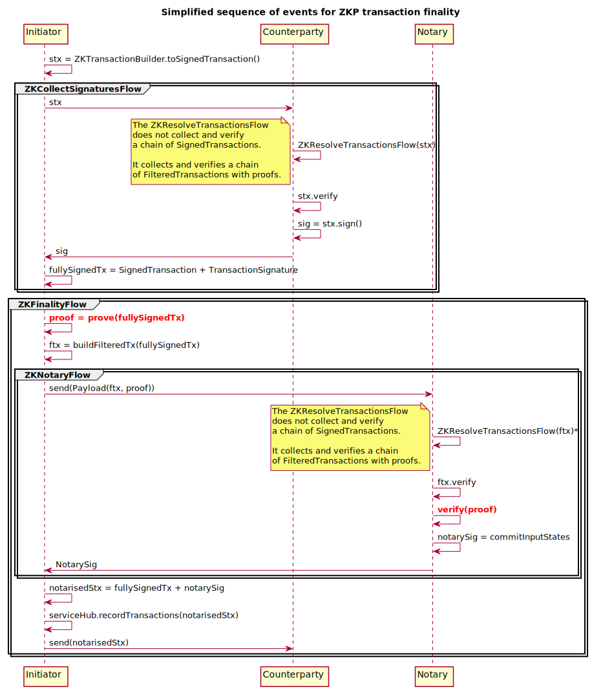

# Context: ZKP integration points

End user Cordapps making use of ZKP are normal CorDapps. The nodes they run on are normal Corda nodes in all ways: their Corda version, their CorDapp classes for flows, states, contracts, etc. are all normal Kotlin.

That said, there are differences with a non-ZKP CorDapp, using standard Corda.

End user CorDapps that want to do ZKP transactions:

* depend on the ZKP CorDapp, which will provide all ZK code they need. This includes ZK-variants for core flows, custom serialization logic, custom hash functions, ZKP proving/verifying services, etc. In essence this is only platform code and not used for contract verification on the JVM: like for Corda itself we assume nodes run versions of the ZKP CorDapp that produce compatible transactions. As far as we can see, this means no ZKP code needs to be distributed as part of transaction attachments.
* use a ZKTransactionBuilder to create WireTransactions. This is mostly to make sure the stucture and content of transactions are fixed size.
* call ZKP flows from their flows: ZKFinalityFlow instead of FinalityFlow, etc. These flows:
    * Create ZKProofs for txs they want to have verified. This is done by calling an external tool (Zinc, Rust).
    * Store ZKProofs for each SignedTransaction in a custom transaction storage (extension).
    * When verifying a transaction, the linked ZKProof is also verified by using Zinc. (This is done outside the sandbox, all other verification on FilteredTransactions will happen in Corda/JVM as normal)
* need to make some minor adjustments to their states and contracts for ZKP compatibility.
* send their signed transactions to a ZKP Notary for notarisation.
* TBD: Network Parameters define: Merkle leaf hash algo and serialization factory.

## Simplified sequence of events for ZKP transaction finality. 

Most of it is identical to normal Corda. For most flows there is a ZK* veriant so that it can do additional actions, but behaviour is the same. Completely new actions are **bolded** red.


# Serialization: scope and definitions

To avoid confusion, let's make explicit what type of serialization to focus the discussion on. In Corda, there are three core purposes for serialization, excluding JSON serialization for RPC. By default, all of the them are Corda-flavour AMQP:

* Flow checkpoint serialization
* Transport serialization: sending payloads to other nodes
* Transaction component serialization as input for Merkle leaf hashing

More detailed discussion follows per type

## Flow checkpoint serialization

Out of scope. We treat this as fully transparent.

## Transport serialization: sending payloads to other nodes

TL;DR:

Out of scope for our purposes and also treated as fully transparent: transport serialization does not impact ZKP nodes: like standard nodes, they make normal use of Corda's Flow framework and communication layer.

Details:

Any payload can be sent to other nodes, not just transactions. Serialisation of payloads is intended to be transparent to the sending and receiving nodes. It is hidden and hardcoded in `FlowSession`. In some cases you may need to annotate with `@CordaSerializable`.

Before sending over the wire, payloads are serialized using Corda AMQP. This is done when a flow calls `FlowSession.send(payload: Any)`, which then calls `payload.serialize()`. Because it uses the extension function `Any.Serialize`, this is hardcoded to use `SerializationFactory.defaultFactory`

Similarly, on reception, the payload is deserialized in `FlowSession.receive()`. Again, the serializationFactory used here is hardcoded in `Any.checkPayloadIs()`: `val serializer = SerializationDefaults.SERIALIZATION_FACTORY`.

## Transaction component serialization as input for Merkle leaf hashing

To be able to create leaf hashes for transaction components, transaction components need to be transformed in such a way that they are acceptable inputs to hash functions. This means transforming them deterministically to a byte representation that uniquely represents the transaction component.

Currently, this serialization is hardcoded to use Corda AMQP:

```
TransactionBuilder.toWireTransaction() : WireTransaction 
|__ TransactionUtils.kt::createComponentGroups()
    |__ Any.serialize() 
```

`TransactionUtils.kt::createComponentGroups()` does not accept parameters for serialization. The result is that `SerializationFactory.defaultFactory` is always used.

This results in a WireTransaction that looks like this:

```kotlin
class WireTransaction {
    val componentGroups: List<ComponentGroup>
    val privacySalt: PrivacySalt = PrivacySalt()

    val inputs: List<StateRef> = deserialiseComponentGroup(componentGroups, StateRef::class, INPUTS_GROUP)
    // left out other fields for brevity 
}
```

When a recipient want to access the field `inputs`, its contents are lazily deserialized from the componentGroups.

This means that even if we create a custom TransactionBuilder that uses custom serialization, this would not work, since WireTransaction/TraversableTransaction is hardcoded to use `deserialiseComponentGroup` without the `factory` parameter, defaulting to `SerializationFactory.defaultFactory`.

> Request: Like for the hash algorithm for the Merkle tree, we would need to be able to inject into the WireTransaction the serialization factory to use for transaction component deserialization.


# Obsolete: one way transaction commponent fingerprinting as input for Merkle leaf hashing

> ! No longer applicable. Included only for entertainment purposes

To be able to create leaf hashes for transaction components, transaction components need to be transformed in such a way that they are acceptable inputs to hash functions. This means transforming them deterministically to a byte representation that uniquely represents the transaction component.

There are multiple ways to achieve this.

One of them is serialization: `Object -> ByteArray -> Object`. This is what used in Corda currently, not just for turning objects into bytes, but also in order to support unknown component groups on nodes with older Corda versions.

> ### Unknown Component Group support
>
> In Corda, the enum class `ComponentGroupEnum` lists the supported component groups. Their ordering matters as it is used to order the leaves in the Merkle tree.
>
> When a WireTransaction calculates its Merkle root, it uses all component groups ordered by their group index, even if that component group is not in its `ComponentGroupEnum`. This guarantees that different versions of Corda that may not be aware of the same groups will always calculate the same Merkle root.
>
> Obviously, this only applies to the Merkle tree. Since the new component group is unknown to the older Corda version, it will not deserialize it into some property on WireTransaction and therefore can't be used in transaction verification.
>
>> Question: how did this go when the component group for Reference states was introduced in Corda 4? We have found no instructions on this in the Corda 4 upgrade instructions. Is this flexibility feature actually used in practice as intended? If not, R3 could consider moving to one-way serialization as an optimization.

***Assuming that this feature is still a requirement for Corda 5, it rules out one-way serialization of component groups***. That would make it impossible for older nodes to use new component groups for Merkle root calculation.

If support across Corda versions for unknown component groups is *not* a requirement, there is another option: [Fingerprinting](https://en.wikipedia.org/wiki/Fingerprint_(computing)): `Object -> ByteArray`.

In this case, it would be ok if recipients always reserialize transaction components on the fly whenever they need to recalculate the Merkle root.

> ### Performance assumption
>
> whenever a node receives a transaction, it always recalculates the Merkle root, and also always verifies the transaction. If this assumption is correct, there is no performance difference between the two options: in the case of one-way serialization, serialization would always be performed. In the case of standard two-way serialization, *de*serialization is always performed. Only if there are many more situations where the transaction id is accessed, but the transaction is not verified, is there a performance benefit for two-way serialization.

If both component group support and performance are not an issue, then one-way may be an interesting optimization. Fingerprints are simpler and smaller in size: there is no metadata needed to be stored with the fingerprint, as it is not necessary to reconstite the original object later on. But it is a minor optimization. In ZKP context it would have slightly more impact, but not significantly enough to push for such a major change in Corda.

Notes:

* Serialization of component groups is not required for transport to other nodes. Transaction payloads are serialized transparently by the transport serialization described above.
* Serialization of component groups is not required for tamperproofing transaction contents. In both two-way and one-way serialization, a transaction recipient will always be able to confirm that the transaction id matches the transaction contents by recalculating it on the fly 
