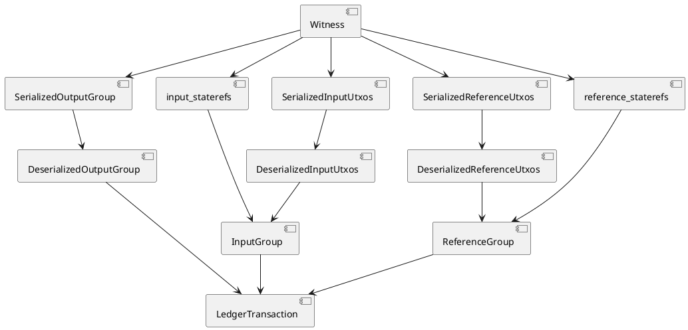

# Contract rules verification

This document discusses the design for contract rule verification.
The work in this document depends on the idea that zinc sources for types can be generated, see POC branch: feature/zinc-source-generator.

Ideally the user wouldn't need to write contract rule verification code in zinc. However at the moment it seems a bit too far away to be
able to offer that. So as an alternative we can make writing contract rule verification code as accessible and friendly as possible.

This document proposes the following strategies to make writing contract rules easier.

- Deserialize the whole `Witness` to a `LedgerTransaction` that is as close as possible to the corda `LedgerTransaction`.
- Generating common convenience methods on collections (List, Map) for easier access to (nested) data fields and verifications.
    - in generated zinc code
    - using zinc compiler extensions/gadgets
- Updating zinc, to allow method invocations on variables, i.e. `id.equals(other_id)` instead of `UniqueIdentifier::equals(id, other_id)`.
    - Consists of backporting 2 commits from zinc 0.2.x to ING-0.1.5

## Assumptions

This section lists all the assumptions this document depends on.

1. The impact of deserializing everything instead of just what's used in the contract rules is negligible in terms of the performance of zinc prove/verify.
2. Having many unused functions in the zinc sources does not impact the performance of zinc setup/run/prove/verify.
3. AttachmentConstraint is determined on circuit/network level, it cannot change per state.
4. A single PublicKey algorithm is used for the whole circuit/network, except for the notary.
5. All commands are TypeOnlyCommandData, so have no data/contents.
6. Parties are not resolved for commands in a LedgerTransaction, see CommandWithParties deprecation annotation. So only PublicKeys are resolved.
7. Ordering of inputs\_group and inputs\_utxos and reference\_group and reference\_utxos is the same, so inputs and references can be wrapped into a StateAndRef structure deterministically.
8. Notary is always a full Party.
9. Gadgets perform better than corresponding zinc code. (To be confirmed...)
10. Zinc code exists for AttestationPointer.isPointingTo(StateRef)

## Deserialize the whole `ZKLedgerTransaction`

- Parse the `WireTransaction`, or `Witness` to `LedgerTransaction`
    - resolving all references to `StateAndRef`
    - parsing commands and signers, and put them together again to `CommandWithSigners` or `CommandWithSignerKeys`

### Assumptions

1. The impact of deserializing everything instead of just what's used in the contract rules is negligible

## Utility functions to ease writing `contract_rules.zn`

Make it more easy to write `contract_rules.zn`, by adding the following methods on collections:

- `list_of(elements: [T; CAPACITY]) -> List<T>`: Convenience constructor without the size argument.
- `contains(this: List<T>, element: T) -> bool`: Assess whether `this` list contains `element`.
- `is_subset(this: List<T>, that: List<T>) -> bool`: Assess whether `that` is a subset of `this`, meaning that all elements of `that` also exist in `this`.
- `distinct(this: List<T>) -> List<T>`: Construct a new list without any duplicates.
- `is_distinct(this: List<T>) -> bool`: Assess whether this list contains no duplicates.
- `all_equals(this: List<T>, element: T) -> bool`: Assess whether all elements in the list are equal to `element`.
- `has_size(this: List<T>) -> bool`: Assess whether the list has the given `size`.
- `is_empty(this: List<T>) -> bool`: Assess whether the list is empty.
- `extract_FIELD(this: List<T>) -> List<R>`: Construct a new list by taking the `FIELD` element of all the elements in the list, similar to `this.map { it.FIELD }`.
- `all_FIELD_equals(this: List<T>, element: R) -> bool:`Assess whether for all elements in the list, `FIELD` fields are equal to `element`. This is basically a combination of `extract_FIELD` and `all_equals`.
- `index_of_single_by_FIELD(this: List<T>, by: R) -> u32`: Return the index of the only element in the list where `FIELD` equals `by`, similar to `this.indexOfSingle { it.FIELD == by }`.
- `single_by_FIELD(this: List<T>, by: R) -> T`: Return the single element from the list where `FIELD` equals `by`, similar to `this.single { it.FIELD == by }`.

Adding the following functions for arrays using zinc compiler gadgets:

- `contains(this: [T], element: T) -> bool`: Assess whether `this` array contains `element`.
- `is_subset(this: [T], that: [T]) -> bool`: Assess whether `that` is a subset of `this`, meaning that all elements of `that` also exist in `this`.
- `distinct(this: [T]) -> [T]`: Construct a new array without any duplicates.
- `is_distinct(this: [T]) -> bool`: Assess whether this array contains no duplicates.
- `all_equals(this: [T], element: T) -> bool`: Assess whether all elements in the array are equal to `element`.

### Zinc adjustments

Zinc array gadgets should be added in the following locations:

| file                                                             | action                      |
|:-----------------------------------------------------------------|:----------------------------|
| zinc-bytecode/src/builtins.rs                                    | Add array extension methods |
| zinc-compiler/src/semantic/scope/builtin.rs                      | Add array extension methods |
| zinc-compiler/src/semantic/element/type/function/stdlib/         | Add implementation          |
| zinc-compiler/src/semantic/element/type/function/stdlib/mod.rs   | Add array extension methods |
| zinc-compiler/src/semantic/element/type/function/stdlib/tests.rs | Add tests                   |
| zinc-vm/src/instructions/call_builtin.rs                         |                             |
| zinc-vm/src/stdlib/array/                                        | Add implementation          |
| zinc-vm/src/stdlib/array/mod.rs                                  |                             |
| zinc-tester/tests/std/                                           | Add tests                   |

### Field expansion

For all the methods in the list of utility functions that use the `FIELD` notation, these methods are generated when the list
element type is a `Struct`, recursively for all elements in the `Struct`. So consider the following types:

```rust
struct A {
  foo: u32,
}
struct B {
  bar: i8,
  baz: A
}
```

For a `List<B>` with capacity 8, it will generate the following `extract_FIELD` methods:

```rust
impl BList8 {
  fn extract_bar(this: BList8) -> I8List8 { ... }
  fn extract_baz_foo(this: BList8) -> U32List8 { ... }
  fn extract_baz(this: BList8) -> AList8 { ... }
}
```

### Assumptions

1. Having many unused functions in the zinc sources does not impact the performance of zinc setup/run/prove/verify.

### Feasibility

To assess the feasibility of these methods, most of these have been prototyped on the `feature/zinc-source-generator` branch.

## Zinc improvements, self-references

Zinc 0.2.x contains two commits that, amongst other features, add self-references, or method style invocation to zinc.

- https://github.com/matter-labs/zinc/commit/3e15a974cedb571dc7d0c01def15c1e0186fd8a6
- https://github.com/matter-labs/zinc/commit/416df8d188eab6b7806f4e99a1c36f18673ae6dc

These commits cannot be backported as is, but should be used for inspiration.
The goal is to allow methods to be invoked directly on variables as receiver parameter, so for example:

```rust
// old
struct Foo {
    bar: u32,
}

impl Foo {
    fn new(bar: u32) -> Self {
        Foo { bar: bar }
    }

    fn baz(foo: Foo, foo_bar: u32) -> u32 {
        foo.bar + foo_bar
    }
}

let foo = Foo::new(3);
assert!(
    Foo::baz(foo, 5 as u32) == 8
);
```


```rust
// new
struct Foo {
    bar: u32,
}

impl Foo {
    fn new(bar: u32) -> Self {
        Foo { bar: bar }
    }

    fn baz(self, foo_bar: u32) -> u32 {
        self.bar + foo_bar
    }
}

let foo = Foo::new(3);
assert!(
    foo.baz(5 as u32) == 8
);
```

### Impacted files

The table below contains a list of files that, in all likelyhood, need to be updated. There may be more, but this list is a good starting point.

| file                                                        | impact                           |
|-------------------------------------------------------------|----------------------------------|
| vscode/syntaxes/zn.tmLanguage.json                          | Add self                         |
| zinc-book/src/appendix/A-grammar-lexical.md                 | Add self                         |
| zinc-book/src/appendix/B-grammar-syntax.md                  | Update fn_statement, add call    |
| zinc-book/src/appendix/C-keywords.md                        | Update reserved keywords         |
| zinc-compiler/src/lexical/token/lexeme/keyword.rs           | SelfLowercase no longer reserved |
| zinc-compiler/src/syntax/parser/statement/fn.rs             | Update fn statement              |
| zinc-compiler/src/syntax/parser/expression/terminal/list.rs | Update function arguments        |
| zinc-compiler/src/syntax/tree/pattern\_binding/mod.rs       | Add self as pattern              |
| zinc-compiler/src/syntax/tree/statement/fn/mod.rs           | Function/Method definition       |
| zinc-compiler/src/semantic/scope/tests.rs                   | Add self and Self tests          |
| zinc-compiler/src/generator/expression/operand/list/mod.rs  | Add self parameter               |

### Task and Concerns

- Getting it to work, AKA. the happy flow
- Error handling and reporting

# Circuit Generation

A zinc circuit is a self-contained folder with all the zinc sources that are needed. This includes:

- Zargo.build: The build file
- main.zn: The zinc circuit entry point
- Witness (WireTransaction), including all types and groups it depends on
- LedgerTransaction: The deserialized Witness, including all types it depends on, like
  - Groups, like InputGroup, OutputGroup and ReferenceGroup
  - State types, including all types it depends on

The entrypoint to create all the code for a circuit is `CircuitMetadata`. The `CircuitMetadata` is used together with fixed-size serialization annotations on kotlin classes to generate as user-friendly code as possible.

## CircuitMetadata

The example below proposes the data that is needed for full circuit generation. This is described in kotlin DSL format.

```kotlin
import io.ivno.collateraltoken.contract.Deposit
import io.ivno.collateraltoken.contract.DepositContract
import io.ivno.collateraltoken.contract.IvnoTokenType
import io.onixlabs.corda.bnms.contract.membership.Membership
import io.onixlabs.corda.bnms.contract.membership.MembershipAttestation
import net.corda.core.contracts.SignatureAttachmentConstraint
import net.i2p.crypto.eddsa.EdDSAPublicKey

val circuit = circuitMetadata {
    circuit {
        name = "deposit-advance"
        attachmentConstraintType = SignatureAttachmentConstraint::class
        publicKeyType = EdDSAPublicKey::class
    }
    userAttachments(0) // Contract attachment are added automatically and calculated based on the number of contracts in the transaction, in this case 4.
    //  userAttachments { // NOTE: re-evaluate when adding support for serialization of attachment contents.
    //      <KClass> to <size>
    //  }
    inputs {
        Deposit::class to 1
    }
    //    addInputGroup {
    //        kClass = Deposit::class
    //        stateGroupSize = 1
    //    }
    outputs {
        Membership::class to 1
    }
    //    addOutputGroup {
    //        kClass = Membership::class
    //        stateGroupSize = 1
    //    }
    references { // NOTE: The assumption here is that there is no additional metadata needed per referenceType.
         Membership::class to 3,
         MembershipAttestation::class to 3,
         IvnoTokenType::class to 1
    }
    //      referenceType {
    //        type = Membership::class
    //        size = 3
    //      }
    //      referenceType {
    //        type = MembershipAttestation::class
    //        size = 3
    //      }
    //      referenceType {
    //        type = IvnoTokenType::class
    //        size = 1
    //      }
    commands {
        command(DepositContract.Advance::class) {
            numberOfSigners = 2
        }
    }
    notary {
        publicKeyType = EdDSAPublicKey::class
    }
    timewindow() // NOTE: present when called, otherwise absent
    // networkParameters: Always present from corda 4 onwards.
}
```

Below, for completeness the `Witness` format is described. We don't expect any changes needed here.

```rust
// Map<ContractState.name, TransactionState<ContractState>>
struct SerializedOutputGroup {
    memberships: [[bool; CORDA_MAGIC_BYTES + MEMBERSHIP_TRANSACTION_STATE_LENGTH]; 1],
}
// List<StateRef>
typedef SerializedInputGroup = [[bool; CORDA_MAGIC_BYTES + STATE_REF_LENGTH]; <NUMBER_OF_INPUTS>];
// List<StateRef>
typedef SerializedReferenceGroup = [[bool; CORDA_MAGIC_BYTES + STATE_REF_LENGTH]; <NUMBER_OF_REFERENCES>];

struct Command {
  id: u32
}
// List<CommandData>
typedef SerializedCommandGroup = [[bool; CORDA_MAGIC_BYTES + COMMAND_LENGTH]; <NUMBER_OF_COMMANDS>];
// List<SecureHash>
typedef SerializedAttachmentGroup = [[bool; CORDA_MAGIC_BYTES + SECURE_HASH_LENGTH]; <NUMBER_OF_ATTACHMENTS>];
// List<Party>
typedef SerializedNotaryGroup = [[bool; CORDA_MAGIC_BYTES + PARTY_LENGTH]; 1];
// List<TimeWindow>
typedef SerializedTimeWindowGroup = [[bool; CORDA_MAGIC_BYTES + TIME_WINDOW_LENGTH]; 0 or 1];
// List<SecureHash>
typedef SerializedParametersGroup = [[bool; CORDA_MAGIC_BYTES + SECURE_HASH_LENGTH]; 1];
// List<List<PublicKey>>
typedef SerializedSignersGroup = [[bool; CORDA_MAGIC_BYTES + ED_DSA_PUBLIC_KEY]; <NUMBER_OF_SIGNERS>];
// Map<ContractState.name, TransactionState<ContractState>>
struct SerializedInputUtxos {
    deposits: [[bool; CORDA_MAGIC_BYTES + DEPOSIT_TRANSACTION_STATE_LENGTH]; 1],
}
// Map<ContractState.name, TransactionState<ContractState>>
struct SerializedReferenceUtxos {
    memberships: [[bool; CORDA_MAGIC_BYTES + MEMBERSHIP_TRANSACTION_STATE_LENGTH]; 3],
    membership_attestations: [[bool; CORDA_MAGIC_BYTES + MEMBERSHIP_ATTESTATION_TRANSACTION_STATE_LENGTH]; 3],
    ivno_token_types: [[bool; CORDA_MAGIC_BYTES + IVNO_TOKEN_TYPE_TRANSACTION_STATE_LENGTH]; 1],
}
struct Witness {
    inputs: SerializedInputGroup,
    outputs: SerializedOutputGroup,
    references: SerializedReferenceGroup,
    commands: SerializedCommandGroup,
    attachments: SerializedAttachmentGroup,
    notary: SerializedNotaryGroup,
    time_window: SerializedTimeWindowGroup,
    parameters: SerializedParametersGroup,
    signers: SerializedSignersGroup,

    privacy_salt: PrivacySaltBytes,

    input_nonces: [NonceDigestBytes; INPUT_GROUP_SIZE],
    reference_nonces: [NonceDigestBytes; REFERENCE_GROUP_SIZE],

    serialized_input_utxos: SerializedInputUtxos,
    serialized_reference_utxos: SerializedReferenceUtxos
}
```
The next diagram shows how input, output and references are converted from `Witness` to `LedgerTransaction`. 



from this configuration and the given `Witness`, we can generate the following `LedgerTransaction`

```rust
struct DepositTransactionState {
    data: Deposit,
    contract: ByteArray_100,
    notary: PartyEdDSA,
    encumbrance: NullableI32,
    constraint: SignatureAttachmentContraint,
}

struct MembershipTransactionState {
    data: Membership,
    contract: ByteArray_100,
    notary: PartyEdDSA,
    encumbrance: NullableI32,
    constraint: SignatureAttachmentContraint,
}

struct MembershipAttestationTransactionState {
    data: MembershipAttestation,
    contract: ByteArray_100,
    notary: PartyEdDSA,
    encumbrance: NullableI32,
    constraint: SignatureAttachmentContraint,
}

struct IvnoTokenTypeTransactionState {
    data: IvnoTokenType,
    contract: ByteArray_100,
    notary: PartyEdDSA,
    encumbrance: NullableI32,
    constraint: SignatureAttachmentContraint,
}

struct DepositStateAndRef {
    state: DepositTransactionState,
    ref: StateRef,
}

struct MembershipStateAndRef {
    state: MembershipTransactionState,
    ref: StateRef,
}

struct MembershipAttestationStateAndRef {
    state: MembershipAttestationTransactionState,
    ref: StateRef,
}

struct IvnoTokenTypeStateAndRef {
    state: IvnoTokenTypeTransactionState,
    ref: StateRef,
}

struct InputGroup {
    deposits: DepositStateAndRefList1,
}

struct OutputGroup {
    memberships: MembershipTransactionStateList1,
}

struct ReferenceGroup {
    memberships: MembershipStateAndRefList3,
    membership_attestations: MembershipAttestationStateAndRefList3,
    ivno_token_types: IvnoTokenTypeStateAndRefList1,
}

struct AdvanceCommand {
    signers: EdDSAPublicKeyList1,
}

struct CommandsGroup {
    advance: AdvanceCommand,
}

struct LedgerTransaction {
    inputs: InputGroup,
    outputs: OutputGroup,
    references: ReferenceGroup,
    commands: CommandsGroup,
    attachments: SecureHashList4,
    notary: PartyEdDSA,
    time_window: NullableTimeWindow,
    parameters: NullableSecureHash,

    privacy_salt: PrivacySalt,
}
```

To deserialize `signers` and `commands` into `CommandsGroup`, we need to follow the same logic as performed in
`net.corda.core.internal.TransactionUtilsKt.deserialiseCommands`.

The `signers` and `commands` are combined into one group, since signers belong to commands.

# Contract rule verification example

With the proposed measures in this document, we expect that contract rule verification will look something like:

```rust
fn verify(transaction: LedgerTransaction) {
    dbg!("[Deposit.Request] Verifying contract rules");
    // --> Transaction structure is ensured by the circuit.
    // val depositInputs = tx.inputsOfType<Deposit>()
    // val depositOutputs = tx.outputsOfType<Deposit>()
    // val tokenTypeReferences = tx.referenceInputsOfType<IvnoTokenType>()
    // val membershipReferences = tx.referenceInputRefsOfType<Membership>()
    // val membershipAttestationReferences = tx.referenceInputsOfType<MembershipAttestation>()
    //
    // CONTRACT_RULE_DEPOSIT_INPUTS using (depositInputs.isEmpty())
    assert!(transaction.inputs.deposits.is_empty());
    // CONTRACT_RULE_DEPOSIT_OUTPUTS using (depositOutputs.size == 1)
    assert!(transaction.outputs.deposits.has_size(1));
    // CONTRACT_RULE_TOKEN_TYPE_REFERENCES using (tokenTypeReferences.size == 1)
    assert!(transaction.references.ivno_token_types.has_size(1));

    // val depositOutput = depositOutputs.single()
    let deposit_output: Deposit = transaction.outputs.deposits.get(0).state;

    // val tokenTypeReference = tokenTypeReferences.single()
    let ivno_token_type: IvnoTokenType = transaction.references.ivno_token_types.get(0).state;

    // val membershipHolders = membershipReferences.map { it.state.data.holder }
    let memberships = transaction.references.memberships.extract_state();
    let membership_holders = memberships.extract_holder_value();

    // val membershipAttestationHolders = membershipAttestationReferences.map { it.holder.value }
    let membership_attestations = transaction.references.membership_attestations.extract_state();
    let membership_attestation_holders = membership_attestations.extract_holder_value();

    // --> @Transient
    // --> override val participants: List<AnonymousParty> = listOf(depositor, custodian, tokenIssuingEntity)
    let mut participants = PolyPartyEdDSAList3::listOf([deposit_output.depositor, deposit_output.custodian, deposit_output.token_issuing_entity]);

    // CONTRACT_RULE_MEMBERSHIP_REFERENCES using (depositOutput.participants.all { it in membershipHolders })
    assert!(
        membership_holders.is_subset(participants);
        "On deposit requesting, a membership state must be referenced for each deposit participant."
    );        

    // CONTRACT_RULE_MEMBERSHIP_ATTESTATION_REFERENCES using (depositOutput.participants.all { it in membershipAttestationHolders })
    assert!(
        membership_attestation_holders.is_subset(participants);
        "On deposit requesting, a membership attestation state must be referenced for each deposit participant."
    );

    // CONTRACT_RULE_MEMBERSHIP_ATTESTATION_STATUS using (membershipAttestationReferences.all { it.status == AttestationStatus.ACCEPTED })
    let membership_attestation_statusses = membership_attestations.extract_attestation_status();
    assert!(
        membership_attestation_statusses.all_equals(AttestationStatus::ACCEPTED),
        "On deposit requesting, every membership attestation status must be ACCEPTED."
    );
    // Alternatively
    assert!(
        membership_attestation_statusses.all_attestation_status_equals(AttestationStatus::ACCEPTED),
        "On deposit requesting, every membership attestation status must be ACCEPTED."
    );

    // CONTRACT_RULE_MEMBERSHIP_NETWORK using (membershipReferences.all { it.state.data.network == tokenTypeReference.network })
    let membership_networks = memberships.extract_network();
    assert!(
        membership_networks.all_equals(ivno_token_type.network),
        "On deposit requesting, every membership's network must be equal to the Ivno token type network."
    );
    // Alternatively
    assert!(
        membership_networks.all_network_equals(ivno_token_type.network),
        "On deposit requesting, every membership's network must be equal to the Ivno token type network."
    );

    // CONTRACT_RULE_MEMBERSHIP_ATTESTATION_NETWORK using (membershipAttestationReferences.all { it.network == tokenTypeReference.network })
    let membership_attestation_networks = membership_attestations.extract_network();
    assert!(
        membership_attestation_networks.all_equals(ivno_token_type.network),
        "On deposit requesting, every membership attestation's network must be equal to the Ivno token type network."
    );
    // Alternatively
    assert!(
        membership_attestation_networks.all_network_equals(ivno_token_type.network),
        "On deposit requesting, every membership attestation's network must be equal to the Ivno token type network."
    );

    // CONTRACT_RULE_MEMBERSHIP_ATTESTATIONS_POINT_TO_MEMBERSHIP_REFERENCES using (depositOutput.participants.all { participant ->
    //     val membership = membershipReferences.single { it.state.data.holder == participant }
    //     val attestation = membershipAttestationReferences.single { it.holder == participant }
    //
    //     attestation.pointer.isPointingTo(membership)
    // })
    {
        for i in 0..3 {
            let participant = participants.get(i);
            let membership_state_and_ref: MembershipStateAndRef = transaction.references.memberships
                .single_by_state_data_holder(participant);
            let membership_attestation_state_and_ref: MembershipAttestationStateAndRef = transaction.references.membership_attestations
                .single_by_state_holder(participant);

            assert!(
                membership_attestation_state_and_ref.state.pointer.is_pointing_to(membership_state_and_ref.ref),
                "On deposit requesting, every membership attestation state must point to a referenced membership state."
            );
        }
    }

    // CONTRACT_RULE_PARTICIPANTS using (depositOutput.participants.isDistinct())
    assert!(
        participants.is_distinct(),
        "On deposit requesting, the depositor, custodian and token issuing entity must be different participants."
    );

    // CONTRACT_RULE_AMOUNT using (depositOutput.amount > BigDecimalAmount(
    //     BigDecimal.ZERO,
    //     depositOutput.amount.amountType
    // ))
    assert!(
        deposit_output.amount.compare(BigDecimalAmountLinearPointer::empty()) == 1,
        "On deposit requesting, the amount must be greater than zero."
    );

    // CONTRACT_RULE_REFERENCE using (depositOutput.reference == null)
    assert!(
        deposit_output.reference.is_null = true,
        "On deposit requesting, the reference must be null."
    );

    // CONTRACT_RULE_STATUS using (depositOutput.status == DepositStatus.DEPOSIT_REQUESTED)
    assert!(
        deposit_output.status = DepositStatus::DEPOSIT_REQUESTED,
        "On deposit requesting, the status must be DEPOSIT_REQUESTED."
    );

    // CONTRACT_RULE_SIGNERS using (depositOutput.getRequiredSigningKeys().all { it in signers })
    {
        // fun getRequiredSigningKeys(): List<PublicKey> = when (status) {
        //     DepositStatus.DEPOSIT_ACCEPTED,
        //     DepositStatus.DEPOSIT_REJECTED,
        //     DepositStatus.PAYMENT_REJECTED -> listOf(custodian.owningKey)
        //     DepositStatus.PAYMENT_ACCEPTED -> listOf(custodian.owningKey, tokenIssuingEntity.owningKey)
        //     else -> listOf(depositor.owningKey)
        // }
        // --> Due to the previous rule, the above `when` will select `listOf(depositor.owningKey)`
        assert!(
            transaction.commands.advance.signers.contains(deposit_output.depositor_owning_key),
            "On deposit requesting, the depositor must sign the transaction."
        );
    }

    dbg!("[Deposit.Request] Contract rules verified");
}
```
